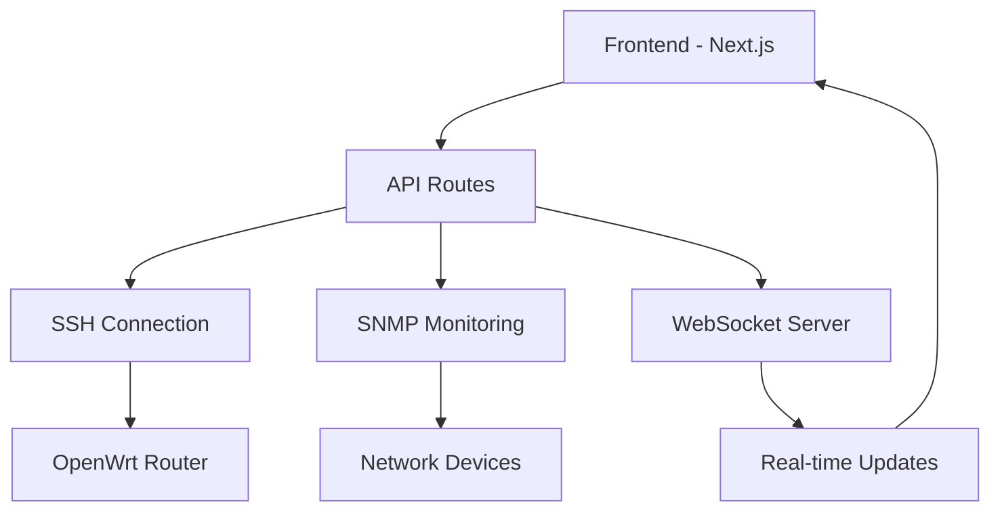

# Smart Home Network Management Dashboard

A comprehensive web-based dashboard for managing OpenWrt routers and IoT devices in your smart home network. Built with modern technologies to provide real-time monitoring, device management, and network analytics.


## 🚀 Features

### 🔄 Real-time Monitoring
- Live network traffic monitoring with WebSocket connections
- Bandwidth usage statistics and performance metrics  
- Device status monitoring with automatic reconnection
- Historical data visualization with interactive charts

### 🏠 Device Management
- Automatic IoT device discovery and cataloging
- Device status monitoring and control capabilities
- MAC address tracking and IP assignment management
- Device categorization and custom naming

### 🌐 Network Topology
- Visual representation of network structure
- Connection status tracking and path visualization
- Subnet management and port monitoring
- Network security and access control

### 🔧 OpenWrt Integration
- Direct router management via SSH and SNMP protocols
- Wireless settings and firewall configuration
- Package installation and system monitoring
- Real-time router performance metrics

## 🛠️ Technology Stack

### Frontend
- **Next.js 14** - React framework with App Router and Server Components
- **TypeScript** - Type-safe JavaScript development
- **Tailwind CSS** - Utility-first CSS framework for responsive design
- **Recharts** - Data visualization and interactive charting
- **Lucide React** - Beautiful icon library

### Backend & Services
- **Socket.io** - Real-time WebSocket communication
- **SNMP** - Network device monitoring protocol
- **SSH2** - Secure Shell connections to routers
- **NextAuth.js** - Authentication and session management

### Development Tools
- **ESLint** - Code linting and quality assurance
- **Prettier** - Code formatting and style consistency
- **TypeScript** - Static type checking

## 📁 Project Structure

```
src/
├── app/                    # Next.js App Router pages
│   ├── analytics/         # Real-time analytics dashboard
│   ├── devices/          # Device management interface
│   ├── docs/             # Project documentation
│   ├── network/          # Network topology visualization
│   ├── openwrt/          # Router management panel
│   ├── settings/         # Configuration settings
│   ├── auth/             # Authentication pages
│   └── api/              # API routes and endpoints
├── components/           # Reusable UI components
│   ├── ResponsiveNavigation.tsx    # Main navigation sidebar
│   ├── RealTimeSmartHomeDashboard.tsx  # Dashboard overview
│   ├── DeviceCard.tsx              # Device display component
│   └── ...                         # Other UI components
├── hooks/               # Custom React hooks
│   ├── useDevices.ts    # Device management hook
│   └── useRealTimeMetrics.ts  # Real-time data hook
├── lib/                 # Utility functions & services
│   ├── ssh.ts          # SSH connection management
│   ├── snmp.ts         # SNMP protocol handlers
│   ├── socket.ts       # WebSocket client setup
│   └── utils.ts        # Helper utilities
├── services/            # External service integrations
├── types/               # TypeScript type definitions
└── middleware.ts        # Next.js middleware
```

## 🚀 Getting Started

### Prerequisites
- Node.js 18+ and npm
- OpenWrt router with SSH access enabled
- Network devices that support SNMP (optional)

### Installation

1. **Clone the repository**
   ```bash
   git clone https://github.com/AdityaDwiNugroho/smart-network-dashboard.git
   cd smart-network-dashboard
   ```

2. **Install dependencies**
   ```bash
   npm install
   ```

3. **Environment configuration**
   ```bash
   cp .env.example .env.local
   ```
   
   Edit `.env.local` with your router credentials:
   ```env
   ROUTER_HOST=192.168.1.1
   ROUTER_USER=root
   ROUTER_PASS=your_password
   SNMP_COMMUNITY=public
   NEXTAUTH_SECRET=your_secret_key
   NEXTAUTH_URL=http://localhost:3000
   ```

4. **Start the development server**
   ```bash
   npm run dev
   ```

5. **Open your browser**
   Navigate to [http://localhost:3000](http://localhost:3000)

### Production Deployment

1. **Build the application**
   ```bash
   npm run build
   ```

2. **Start the production server**
   ```bash
   npm start
   ```

## 📖 Documentation

Visit the built-in documentation at `/docs` for comprehensive guides on:

- **Project Overview** - Understanding the dashboard architecture
- **Technology Stack** - Detailed breakdown of technologies used
- **Getting Started** - Step-by-step setup instructions
- **Architecture** - System design and component structure
- **Features & Usage** - How to use each feature effectively

## 🔧 Configuration

### Router Setup
1. Enable SSH access on your OpenWrt router
2. Configure SNMP (optional but recommended)
3. Update router credentials in environment variables

### Network Discovery
The dashboard automatically discovers devices using:
- DHCP lease information from the router
- SNMP device scanning (if enabled)
- ARP table analysis for active devices

### Real-time Features
- WebSocket server runs on port 3003
- Automatic reconnection with exponential backoff
- Real-time metrics updated every 2 seconds

## 🤝 Contributing

1. Fork the repository
2. Create a feature branch (`git checkout -b feature/amazing-feature`)
3. Commit your changes (`git commit -m 'Add amazing feature'`)
4. Push to the branch (`git push origin feature/amazing-feature`)
5. Open a Pull Request

## 📝 Changelog

### Version 1.0.0 (Latest)
- Complete navigation redesign with sidebar-only layout
- Removed redundant top navigation for cleaner UX
- Fixed content overlap issues with proper spacing
- Added comprehensive documentation system
- Cleaned up unused/broken files
- Enhanced real-time analytics with connection status
- Improved error handling and user feedback

### Previous Updates
- Added real-time WebSocket monitoring
- Implemented device management interface
- Created network topology visualization
- Added OpenWrt router integration
- Built responsive navigation system

## 📄 License

This project is licensed under the MIT License - see the [LICENSE](LICENSE) file for details.

## 🆘 Support

- 📖 Check the [Documentation](/docs) for detailed guides
- 🐛 Report bugs in the [Issues](https://github.com/AdityaDwiNugroho/smart-network-dashboard/issues) section
- 💬 Join our [Discussion](https://github.com/AdityaDwiNugroho/smart-network-dashboard/discussions) for questions

## Architecture Overview



---

**Built with ❤️ for smart home enthusiasts**
